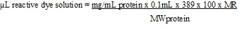
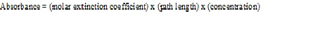
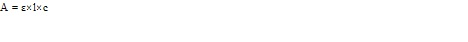
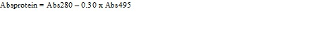

## Materials Required

&nbsp;

1. FITC : 500µg of fluorescein isothiocyanate reactive dye has been taken and added to 5 vials each.To which 50µl of anhydrous DMSO(Dimethyl sulfoxide)  has been  added and gives the reactive dye at a concentration of 10mg/ml in each vial.

2. Anhydrous Dimethylsulfoxide (DMSO) : 0.7ml of DMSO has been taken. 

3. Reaction tubes: five 1.5ml reaction tube has been taken. 

4. Buffer Solutions

    a) PBS Buffer : 1X concentration with 2mM sodium azide

    b) Sodium bicarbonate Buffer :  0.84g of NaHCO3  has been taken and it was dissolved in 9ml of deionized water and the pH of the solution was adjusted to 9 by adding 2N NaOH .Make the final volume of the solution to 10ml by adding distilled water.

 

5. Sephadex G-100 resins : 250mg of gel filtration resin has been taken .From which  40mg should be added to a single spin column and  equilibrated with provided PBS Buffer solution.

    Fractionation range (MW) for sephadex G-100 :   4000-10000 for globular proteins
                                                    1000-10000 for dextrans

 

6. Spin Column

7. Collection tubes

 

All the contents should be stored at 4°C. Protect reactive dye from light. Also DMSO and reactive dye should be protected from moisture.Reagents should be stable for at least 6 months.

&nbsp;

 

## PROCEDURE
 

&nbsp;

### 1. ANTIBODY/PROTEIN PREPARATION
 

1. The purified antibody or protein , buffer solutions and the reagents needed for the experiment are placed in a refrigerator.
 

2. These materials are taken from the refrigerator and arranged it in a neat manner  in the immunology lab.
 

3. Weigh 2mg of purified protein and added to a vial.
 

4. Add 1000µl of sodium bicarbonate buffer to this vial.
 

&nbsp;

### 2. Dialysis of Antibodies

 

1. Take a piece of dialysis tubing from ethanol storage solution with forceps and washed it with distilled water and put one clamp on one side of the tubing.
 

2. Pipette out the entire protein solution from the vial and added to the dialysing tube.
 

3. The air is removed by gently squeezing the tube by sliding fingers all the way up the tube, roll it and  put second clamp on the other end of the tubing.
 

4. Immerse this dialysis tubing in a beaker or flask containing 1X PBS Buffer.
 

5. Put the stir bar in the beaker and the beaker was placed on a magnetic stirrer and keep inside of  visicooler for 2 hrs  at 4°C.
 

6. After 2hrs, take out the beaker  from the visicooler.
 

7. The dialysis tubing has to be taken from the beaker  and content in the tube was transferred to a vial.
 

&nbsp;

### 3. SPIN COLUMN PREPARATION
 

1. Weigh 40mg Sephadex G-100 resin and added to an empty spin column.
 

2. Gently tap the column to insure that the resin has settled to the bottom and keep the column end stopper in place.
 

3. Add 800μl of 1X PBS Buffer with 2mM sodium azide to the column , replace the  cap and vortex for 5 seconds.
 

4. After vortexing the tube was kept at room temperature for 30mts for proper hydration.  
 

5. After 30 minutes, remove the top cap and then the column end stopper from the bottom and the column was  placed a  in 2 ml collection tube.
 

6. Centrifuge the column for 2 minutes at 1000 x g .After proper centrifugation ,the  buffer collected in collection tube was discarded.
 

7. Take the protein  sample from the tube and add it in dropwise to the center of the column in the presence of light , without disturbing the gel surface.  
 

8. Place the column in a collection tube and centrifuge for 5mts  at 1000 x g.
 

9. After centrifugation,take the tube from the centrifuge and show purified sample will collect in the bottom of the collection tube.
 

10. After collecting sample to vial , throw away the used SephadexG-100. 
 

&nbsp;

### 4. DETERMINING DEGREE OF LABELLING
 
1. Fill the cuvette using 1X PBS Buffer with 2mM sodium azide  and used as spectrophotometric blank.
 

2. Fill the cuvette with FITC-protein conjugate and read the absorbance at 280nm and 495nm.
 

3. Transfer the protein load to a light protected vial.
 

4. Add PBS with 2mM sodium azide to protein load and stored  at 4°C.
 

 

&nbsp;

 

## RESULT
 

&nbsp;

The absorbance of FITC-Protein conjugate at 280nm = ………….
 

The absorbance of FITC-Protein conjugate at 495nm = ………….

 
&nbsp;

## CALCULATION
 

**1.The amount of FITC dye required for conjugation reaction:**
 
 

&nbsp;

 

 

Mg/ml protein = concentration of protein taken for the reaction
0.1mL = volume of protein solution
389 = MW of the dye
100 =unit conversion factor
MR = molar ratio of dye to protein in the reaction.

 

The following MRs are recommended, the number in parentheses being a second MR to be used if two reactions are performed to measure optimal labeling:  if protein or antibody is 2-3mg/mL, MR = 40 (60)  if protein is 4-10mg/mL, MR = 30 (50)
 

 
&nbsp;

 **2.Estimation of Protein concentration**
 

  
&nbsp;

                                                            

ε  = extinction coefficient in cm-1 M-1

l=path length is in cm( most standard cuvettes are 1 cm in length)

c=concentration is in moles/liter.

&nbsp;

**Concentration of protein**

 
&nbsp;

 

 

0.30 is a correction factor to compensate for absorption of the dye at 280nm

&nbsp;

 
 

ε =  molar extinction coefficient of the protein at 280nm

For most IgGs, ε = 203,000cm-1M-1
 

&nbsp;

**Concentration of FITC dye**

 
&nbsp;

 

                                              

 

68,000cm-1M-1 = molar extinction coefficient of the dye at pH 8.0 at 495nm
&nbsp;

 

 

                                                       
