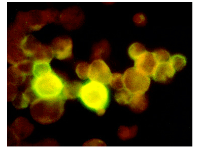

#### INTRODUCTION

Antibody labelling is an important molecular biological technique. Antibodies are widely used in immunoassays to detect and quantify antigens. The antibody that recognizes the antigen is referred to as the ‘primary’ antibody and confers specificity to the assay.The labeling of proteins allows to follow specific molecules using fluorescent microscopy. Fluorescence results from a process that occurs when certain molecules (generally polyaromatic hydrocarbons or heterocycles) called fluorophores, fluorochromes, or fluorescent dyes absorb light. The absorption of light by a population of these molecules raises their energy level to a brief excited state. As they decay from this excited state, they emit fluorescent light.

Normally researches  used to label specific antibodies and then use these to track proteins of interest. Fluorescein isothiocyanate (FITC,green dye) and N-Hydroxysuccinimide (NHS)-ester labeling reagents, such as 5-(and-6)-carboxytetramethylrhodamine succininmidyl ester ((5/6)-TAMRA,red dye), are the simplest and most commonly used reagents for labeling proteins. The isothiocyanate group of FITC will crosslink with amino, sulfhydryl, imidazoyl, tyrosyl or carbonyl groups on a protein.

&nbsp;

### PRINCIPLE

Flouorescence is the property of emitting electromagnetic radiation in the form of light as a result of- and only during –the absorption of light from another source. Many molecules fluoresce, but only a few are routinely used in immunohistochemistry. They are used because of the intensity of their fluorescence and the ability to distinguish the fluorescence from the background autofluorescence of the specimen arising from excitation of endogenous molecules like flavin compounds, NADH, elastin, fibronectin, hemoglobin, or chlorophyll. The point source of fluorescent light is one of the greatest advantages of this labeling technique because it provides better resolution than systems that depend on refracted light for imaging. Typically the wavelength of light needed to excite the fluorophore is larger and of greater intensity than the wavelength of emitted light. The separation of the excitation wavelength maximum and the emission wavelength maximum is referred to as Stokes shift and affects both the brightness and detection of the fluorophore. In practice, the configuration of the detection system- the fluorescence microscope, confocal microscope, or fluorescence activated cell sorter/ analyser- also plays a major role in the fluorescence intensity detected. The light source, excitation filter, dichroic mirror, emission filter, and objective all contribute to the intensity of the fluorescence image.

 

&nbsp;

FLOURESCEINE IMAGE
